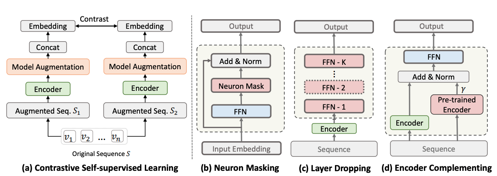

# Improving Contrastive Learning with Model Augmentation
The paper is avaliable online in [arxiv](https://arxiv.org/abs/2203.15508)

## Introduction
This is the repo for paper 'Improving Contrastive Learning via Model Augmentation'. In this paper, we argue existing data augmentation methods for contrastive learning have the following weakness:
1) optimal data augmentation methods are hard to devise,
2) data augmentation methods destroy sequential correlations, 
3) data augmentation fails to incorporate comprehensive self-supervised signals. 
Therefore, we proposed three type of model augmentation methods: `neuron masking`, `layer dropping` and `encoder complementing`.

### Framework


## Reference
If you use our code or follow our work, please cite as follows:
```
@article{liu2022srma,
  title={Improving Contrastive Learning with Model Augmentation},
  author={Liu, Zhiwei and Chen, Yongjun and Li, Jia and Luo, Man and Xiong, Caiming},
  journal={arXiv preprint arXiv:2203.15508},
  year={2022}
}
```

## Implementation
### Requirements
```
Python >= 3.7
Pytorch >= 1.2.0
tqdm == 4.26.0 faiss-gpu==1.7.1
```
### Datasets
We include the information of dataset in `./data/`.

## Scripts
1. run with ```python main.py --data_name Sports_and_Outdoors --gpu_id 0 --batch_size 256 --hidden_dropout_prob 0.5 --num_augmented_layers 2 --layer_drop_num 1``` This step will pretrain an encoder, which is saved in `./output/`
2. Move the encoder to `./pretrain/`
3. run with ```python main.py --data_name Sports_and_Outdoors --gpu_id 0 --batch_size 256  --model_augmentation  --hidden_dropout_prob 0.5 --num_augmented_layers 2 --layer_drop_num 1 --use_pretrain --en_weight 0.5 --rec_model_aug```

### arguments explanation
- `--data_name`: the dataset to use, given in data
- `--model_augmentation`: whether to use model augmentation for sequential recommendation
- `--hidden_dropout_prob`: this is related to neuron masking, which is basically the masking probability in layers.
- `--num_augmented_layers`: this is related to layer dropping augmentation, which is implemented in the `./src/modules.py` as in the class `LayerDrop`
- `layer_drop`： this is the other parameter in layer dropping augmentation, denoting how many augmented layers should be dropped during training. Should be a value less than `num_augmented_layers`.
- `use_pretrain`: this is related to `encoder_complement` augmentation, which adopts a pretrained encoder as a contrastive learning. More details should refer file `trainer.py`, the `SRMATrainer._cl_encoder()` method. 

### Notes
- Current version of code doesn't support individual type of model augmentation. You may implement it by add other condition flags as in `main.py`
- We combine the data augmentation with model augmentation in this individual code. The data augmentation is based on our previous code [CoSeRec](https://github.com/YChen1993/CoSeRec)


## Code Explanation
### Neuron Masking
This model augmentation is related to the dropout ratio in encoder. Two arguments are related to Neuron Masking augmentation, which are `hidden_dropout_prob` and `attention_probs_dropout_prob`. The former controls the dropout probability in all hidden layers (such FC layer or embedding layer), while the later controls the dropout probability specifically for attention layers. Refer those `self.dropout` in file `module.py`

### Layer Dropping
We implement the layer dropping mainly in the `./src/modules.py` as in the class `LayerDrop`. The intuition behind layer dropping is to first append k additional layers after the encoder and then random drop m (args.layer_drop_num in the code) layers. We support append different types of layers, including single layer, intermediate layer, sasrec layer, etc. More details can be found in `./src/modules.py`. 

Besides the randomly m different layers, we also support contigent layer dropping. We first sample a value as the dropping probability for each layer, if it is greater than the given threshold, we will drop it. Otherwise, we will keep it. However, experiments doesn't support its effectiveness in our validation dataset. Welcome try in your own data and discuss with us!

### Encoder Complementing
We implement the encoder complementing by adding the contrastive loss between trained model and pre-trained model. Specifically, in code file `trainers.py`, the method function `SRMATrainer._cl_encoder()` specify this process:
```python
# generate the embedding of the original sequence output from the pretrained encoder. 
ori_sequence_output = encoder.transformer_encoder(original)
ori_sequence_flatten = ori_sequence_output.view(ori_sequence_output.shape[0], -1)
for slice in cl_output_slice:                        
    cl_loss += en_weight*self.cf_criterion(slice, ori_sequence_flatten)

```
`encoder` is from the pretrained encoder. `original` is the item sequence before data augmentation. We add the contrastive loss from two branches. 

## Acknowledgement
We reuse part of code from our previous work [CoSeRec](https://github.com/YChen1993/CoSeRec).
